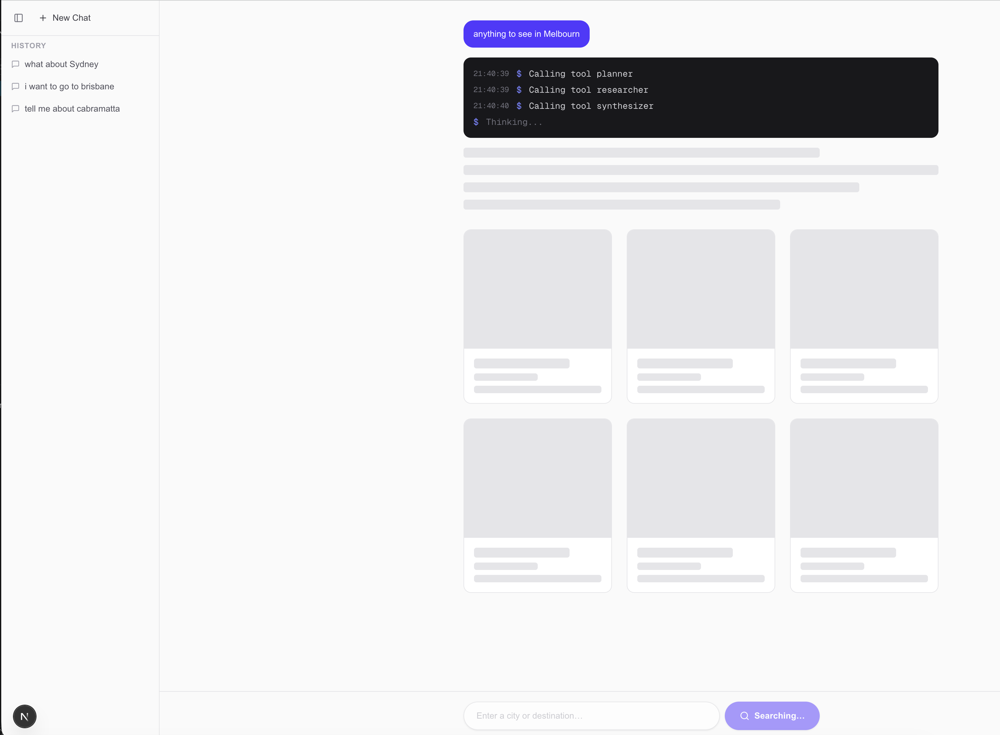
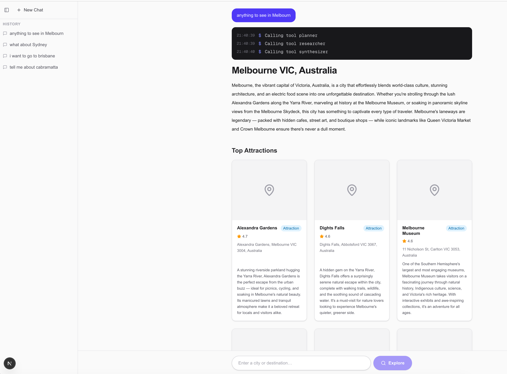
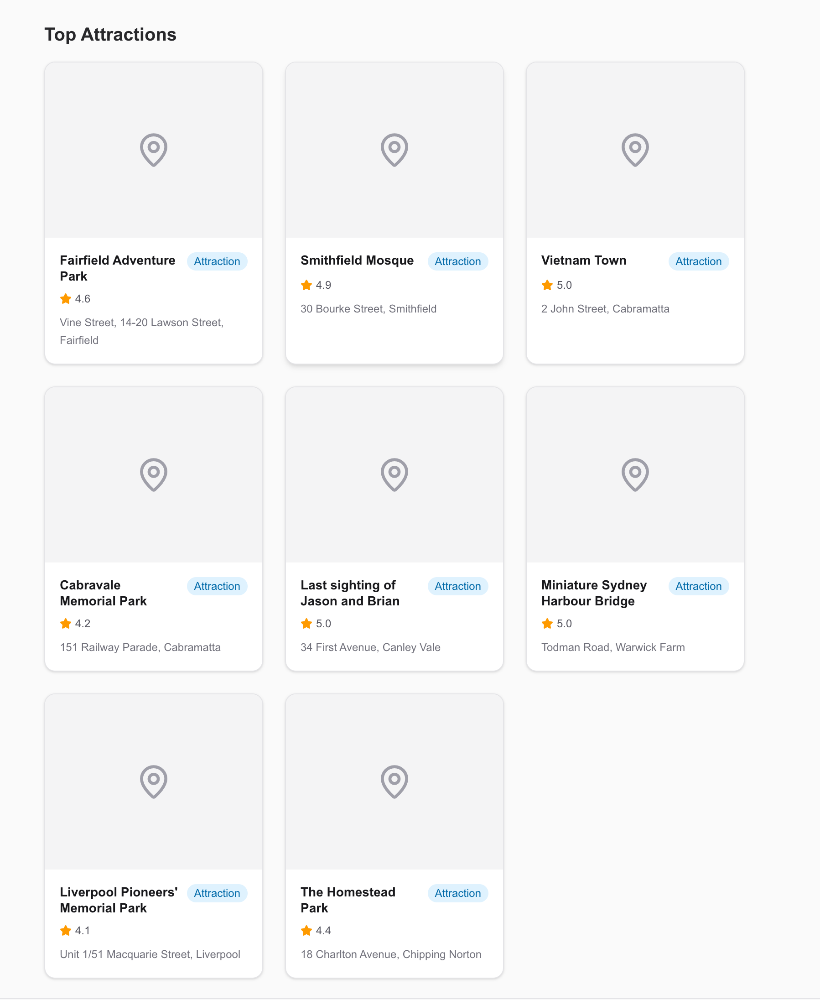
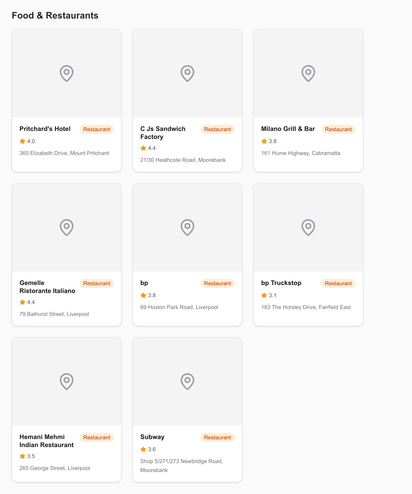
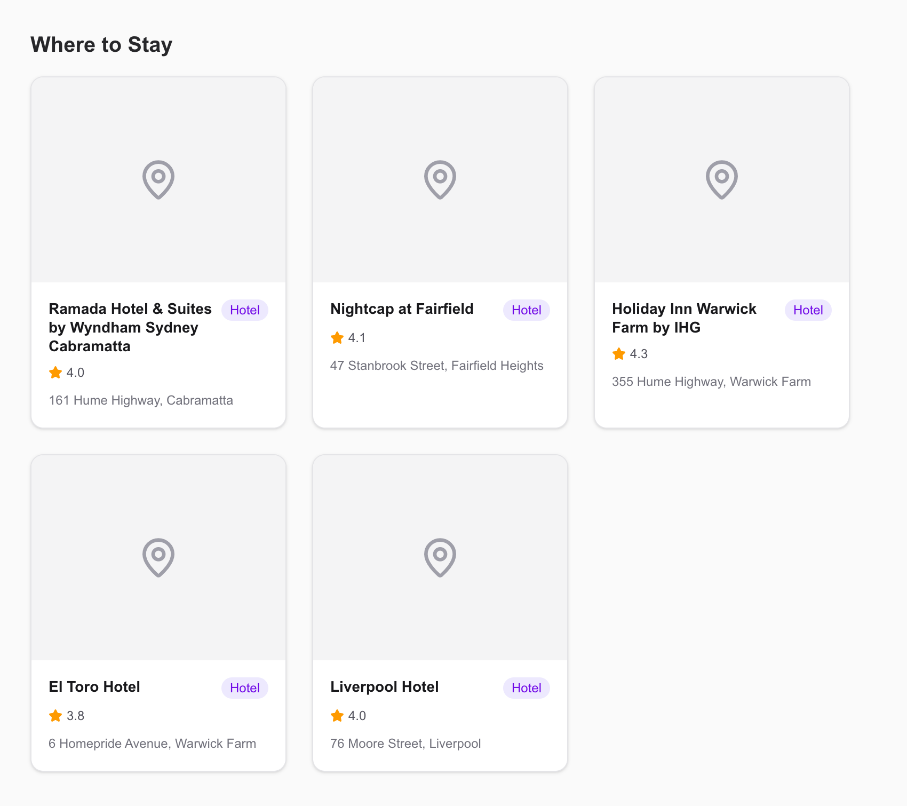
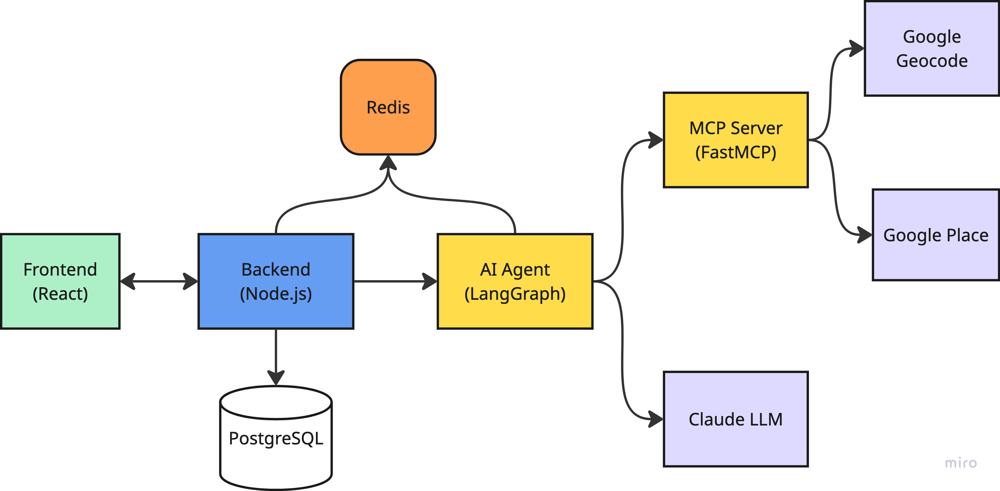

# Tour Guide Agent

An AI travel guide. Type a free-text location query — "anything to see in Sydney" or "weekend in Melbourne" — and get back a curated guide with attractions, restaurants, and hotels. Claude writes the narrative; Google Places provides the data. Multi-turn conversations work, so a follow-up like "what about for families?" carries on from where the last reply left off.

---

## Screenshots

**Streaming tool-call log while the agent processes**



**Completed travel guide with narrative and place cards**









---

## Architecture



```
┌──────────────────────────────────────────────────────────────────┐
│  Browser                                                         │
│  Next.js frontend  (port 3000)                                   │
│  · Search bar, streaming tool-call log, results panel            │
│  · Multi-turn chat with completed-turn history                   │
│  · Sidebar with conversation history                             │
└────────────────────────┬────────────────────┬────────────────────┘
                         │ HTTP  /api/*        │ WS  /ws
                         │ (Next.js proxy)     │ (direct)
┌────────────────────────▼────────────────────▼────────────────────┐
│  Backend  (NestJS · port 8000)                                   │
│  · REST chat API                                                 │
│  · WebSocket gateway — polls Redis and pushes chat-update events │
│  · PostgreSQL  — persists conversations as ChatMessage[]         │
│  · Redis       — live chat state during agent processing         │
│  · Publishes ChatEvent to RabbitMQ (fire-and-forget)            │
└──────────┬───────────────────────────┬───────────────────────────┘
           │ AMQP publish              │ read / write
           │ tour-guide.chat           │
┌──────────▼───────────────┐   ┌───────▼────────────┐
│  RabbitMQ                │   │  Redis             │
│  queue: tour-guide.chat  │   │  key: chat:{uuid}  │
└──────────┬───────────────┘   └────────────────────┘
           │ AMQP subscribe
┌──────────▼───────────────┐
│  AI Agent                │
│  FastAPI · port 8001     │
│  LangGraph ReAct loop    │
│  agent ⇄ tools           │
└──────────┬───────────────┘
           │ MCP (streamable HTTP)
┌──────────▼───────────────┐
│  MCP Server              │
│  FastMCP · port 8002     │
│  POST /mcp/  — MCP only  │
│  resolve_geocode         │
│  search_places           │
└──────────────────────────┘
```

---

## Services

| Service | Port | Directory | Stack |
|---------|------|-----------|-------|
| rabbitmq | 5672 / 15672 | — | RabbitMQ 3 |
| postgres | 5432 | — | PostgreSQL 17 |
| redis | internal | — | Redis 7 |
| mcp-server | 8002 | `mcp-server/` | FastMCP + FastAPI |
| ai-agent | 8001 | `ai-agent/` | FastAPI + LangGraph + LangChain Anthropic |
| backend | 8000 | `backend/` | NestJS 11 + TypeORM |
| frontend | 3000 | `frontend/` | Next.js 15 + React 19 + Tailwind CSS 4 |

### Frontend (port 3000)

- Search bar for free-text location queries
- Opens a WebSocket to `ws://localhost:8000/ws` and receives real-time agent progress events as the agent works
- Live tool-call log (`Calling tool resolve_geocode`, etc.) that updates instantly via WebSocket
- `Thinking…` indicator between tool calls when the agent is processing but hasn't announced the next step
- Final reply renders as a narrative paragraph + place cards (`ResultsPanel`)
- Multi-turn UI — completed turns stay on screen; each new turn processes below
- Left sidebar lists saved conversations; clicking one reloads all turns

### Backend (port 8000)

| Method | Path | Description |
|--------|------|-------------|
| `POST` | `/api/chat/new` | Create conversation in PostgreSQL + Redis, publish `ChatEvent` to RabbitMQ, return `{ id }` |
| `POST` | `/api/chat/:id/cont` | Append user message to history, publish `ChatEvent` to RabbitMQ, return `{ accepted: true }` |
| `GET` | `/api/chat/history` | Return all conversations (id, title, createdAt) |
| `GET` | `/api/chat/:id` | Live `ChatInterface` from Redis, or persisted version from PostgreSQL |
| `POST` | `/api/chat/:id/stop` | Persist `ChatMessage[]` to PostgreSQL, delete Redis key |
| `GET` | `/api/health` | Health check |
| `WS` | `/ws` | Subscribe to real-time chat updates; server polls Redis at 500 ms and pushes `chat-update` events until `agentStatus === hasReplied` |

### AI Agent (port 8001)

Consumes `ChatEvent` messages from the `tour-guide.chat` RabbitMQ queue. For each event, runs a LangGraph ReAct loop with Claude (`claude-sonnet-4-6`), delegating all tool calls to the MCP server via `McpClient` (MCP protocol over streamable HTTP). The system prompt instructs the LLM to skip `resolve_geocode` and `search_places` when place data is already present in conversation history — follow-up queries only rewrite the narrative. When no tools are called, `ChatService` falls back to the `places` and `location` from the most recent completed reply in history so every response has a full result. Agent progress is written to Redis after each node. The backend's WebSocket gateway polls Redis at 500 ms and pushes updates to the browser in real time.

**ReAct loop:**

```
agent node  →  calls LLM with tools bound
     │
     ├── LLM returns tool_calls  →  tools node executes  →  calls MCP server  →  back to agent
     │
     └── LLM returns narrative (no tool_calls)  →  END
```

**Event pipeline:**

```
RabbitMQConsumer
    → ChatEventHandler.handle(message)
        → ChatService.handle(event)
            → AgentGraph.astream(...)
                → McpClient.call(tool, args)
```

**Module structure:**

```
app/
├── agent/
│   ├── contracts/agent_interface.py         — AgentState (extends MessagesState)
│   ├── tools/
│   │   ├── mcp_client.py                    — McpClient (FastMCP Client over streamable HTTP)
│   │   └── tools.py                         — @tool resolve_geocode, @tool search_places
│   ├── agent.py                             — Agent class (LLM + system prompt)
│   └── agent_graph.py                       — AgentGraph class (ReAct graph)
├── configs/settings.py                      — Settings (Pydantic BaseSettings)
├── container.py                             — Container class (cached_property singletons)
├── events/
│   ├── contracts/
│   │   ├── chat_interface.py                — ChatEvent, ChatReply, HistoryMessage
│   │   └── consumer_message.py             — ConsumerMessage (typing.Protocol)
│   ├── handlers/
│   │   └── chat_event_handler.py            — ChatEventHandler
│   └── rabbitmq_consumer.py                 — RabbitMQConsumer
├── main.py                                  — FastAPI app, lifespan starts RabbitMQ consumer
├── routers/
│   └── health_router.py                     — GET /api/health
└── services/
    ├── chat_service.py                      — ChatService (graph execution, Redis streaming)
    ├── chat_manager.py                      — ChatManager (message building, Redis reads/writes)
    └── redis_client.py                      — RedisClient
```

| Method | Path | Description |
|--------|------|-------------|
| `GET` | `/api/health` | Health check |

### MCP Server (port 8002)

Exposes the two Google API tools over the MCP protocol only. All tool calls from the AI agent arrive as streamable HTTP at `POST /mcp/`. Owns the Google API keys; the AI Agent calls it without any direct access to the external APIs.

**Tools:**

| Tool | What it does | API |
|------|-------------|-----|
| `resolve_geocode` | Resolves free-text query to canonical place name + GPS coordinates | Google Geocoding API |
| `search_places` | Fetches nearby attractions, restaurants, and hotels | Google Places API |

**Module structure:**

```
app/
├── configs/settings.py                      — Settings (Pydantic BaseSettings)
├── container.py                             — Container class (GeocodingTool, PlacesTool)
├── fast_mcp.py                              — FastMCP instance + @fast_mcp.tool() definitions
├── main.py                                  — FastAPI app, lifespan wired to FastMCP, /mcp mount
├── routers/
│   └── health_router.py                     — GET /api/health
└── tools/
    ├── geocoding_tool.py                    — GeocodingTool class
    └── places_tool.py                       — PlacesTool class
```

| Method | Path | Protocol | Description |
|--------|------|----------|-------------|
| `POST` | `/mcp/` | MCP | FastMCP streamable HTTP endpoint |
| `GET` | `/api/health` | REST | Health check |

---

## Data model

```
AgentStatus:  isThinking | hasReplied
ChatStatus:   isActive   | isStopped
ChatActor:    User       | Agent

ChatPlace {
  name:        string
  category:    "attraction" | "restaurant" | "hotel"
  address:     string
  rating:      number | null
  description: string
  image_url:   string | null
  source_url:  string | null
}

ChatContent {
  location:  string
  narrative: string
  places:    ChatPlace[]
}

ChatMessage {
  actor:       ChatActor
  text:        string | ChatContent   // string for tool calls/errors; ChatContent for the final reply
  timestamp:   datetime
  agentStatus: AgentStatus | null
}

ChatInterface {
  id:          uuid
  title:       string
  content:     ChatMessage[]
  status:      ChatStatus
  agentStatus: AgentStatus
}
```

The PostgreSQL `content` column stores a flat `ChatMessage[]` directly as `jsonb`. Tool-call progress messages (`isThinking`) and the final reply (`hasReplied`) live in the same array. The frontend uses `typeof text === "object"` to decide whether to render a results panel or a plain text line.

**Sample `content` column value:**

```json
[
  {
    "actor": "User",
    "text": "tell me about Sydney",
    "timestamp": "2026-06-18T00:54:52.046000Z",
    "agentStatus": null
  },
  {
    "actor": "Agent",
    "text": "Calling tool resolve_geocode",
    "timestamp": "2026-06-18T00:54:54.034561Z",
    "agentStatus": "isThinking"
  },
  {
    "actor": "Agent",
    "text": "Calling tool search_places",
    "timestamp": "2026-06-18T00:54:56.798732Z",
    "agentStatus": "isThinking"
  },
  {
    "actor": "Agent",
    "text": {
      "location": "Sydney NSW, Australia",
      "narrative": "Sydney is one of the world's most breathtaking cities...",
      "places": [
        {
          "name": "Sydney Opera House",
          "category": "attraction",
          "address": "Bennelong Point, Sydney",
          "rating": 4.8
        }
      ]
    },
    "timestamp": "2026-06-18T00:55:10.823519Z",
    "agentStatus": "hasReplied"
  }
]
```

---

## Quick start

```bash
# 1. Fill in API keys
cp ai-agent/.env.example ai-agent/.env
cp mcp-server/.env.example mcp-server/.env
# edit ai-agent/.env   — set ANTHROPIC_API_KEY
# edit mcp-server/.env — set GOOGLE_API_KEY

# 2. Start all services
docker-compose up --build
```

Open [http://localhost:3000](http://localhost:3000).

### Required API keys

| Key | Service | Where to get |
|-----|---------|-------------|
| `ANTHROPIC_API_KEY` | `ai-agent/.env` | [console.anthropic.com](https://console.anthropic.com) |
| `GOOGLE_API_KEY` | `mcp-server/.env` | Google Cloud Console — enable **Geocoding API** and **Places API** |
